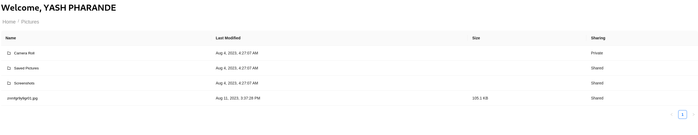

# OneDriveConnectV2 - Yash Pharande

Demo application that uses Microsoft Graph Api to access OneDrive

## Features
* Navigation
* Download Files
* Monitor access to Files and Folders in RealTime using Subscriptions and Web Sockets

## Sample (Implementation)
- Auth

- Navigation

- Download Files

- Monitoring Shared Resources
  
